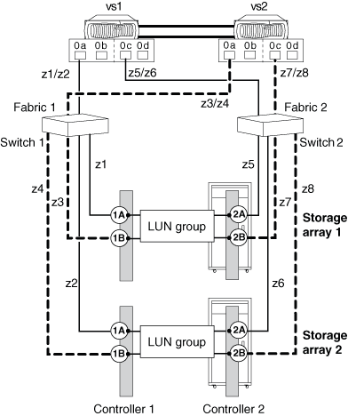
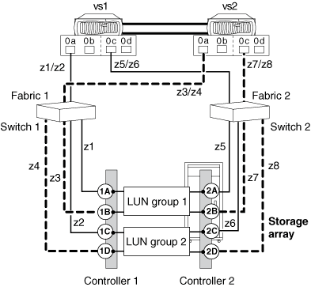

= Exemplo de configuração: Portas do iniciador FC compartilhado
:allow-uri-read: 
:icons: font
:imagesdir: ../media/

[role="lead"]
Uma porta do iniciador de FC em um sistema ONTAP pode ser conectada a até quatro portas de destino em storage arrays separados ou, para alguns storage arrays, a quatro portas de destino nos mesmos storage arrays.

A recomendação de zoneamento de práticas recomendadas é ter cada par de portas iniciador-destino FC em uma zona separada (1:1), mesmo que o mesmo iniciador FC esteja falando com várias portas de destino.

== Porta do iniciador FC compartilhado conetada a portas de vários destinos em storages _separate_

A ilustração a seguir mostra conexões e zoneamento para compartilhar uma porta do iniciador FC com portas de destino em _different_ storage arrays.

As linhas sólidas na ilustração a seguir mostram as conexões das portas do iniciador FC no sistema VS1 e as linhas tracejadas mostram as conexões das portas do iniciador FC no sistema VS2.

A tabela a seguir mostra as definições de zoneamento do 1:1 para o exemplo de uma porta do iniciador FC que compartilha várias portas de destino em diferentes arrays de armazenamento.

|===
| Zona | Sistema ONTAP e porta do iniciador FC | Storage array 

 a| 
*Switch 1*

 a| 
z1
 a| 
vs1:0a
 a| 
Storage array 1: Controlador 1 porta 1A

 a| 
z2
 a| 
vs1:0a
 a| 
Storage array 2: Controlador 1 porta 1A

 a| 
z3
 a| 
vs2:0a
 a| 
Storage array 1: Controlador 1 porta 1B

 a| 
z4
 a| 
vs2:0a
 a| 
Storage array 2: Controlador 1 porta 1B

 a| 
*Switch 2*

 a| 
z5
 a| 
vs1:0c
 a| 
Storage array 1: Controlador 2 porta 2A

 a| 
z6
 a| 
vs1:0c
 a| 
Storage array 2: Controlador 2 porta 2A

 a| 
z7
 a| 
vs2:0c
 a| 
Storage array 1: Controlador 2 porta 2B

 a| 
z8
 a| 
vs2:0c
 a| 
Storage array 2: Controlador 2 porta 2B

|===

== Porta do iniciador FC compartilhado conetada a portas de vários destinos no storage array _same_

Essa configuração só pode ser usada com arrays de storage cujo recurso de mascaramento de LUN, apresentação ou grupo de hosts permite apresentações diferentes de grupos de LUN ao mesmo iniciador FC com base na porta de destino que está sendo acessada.

Alguns storage arrays podem apresentar conjuntos diferentes de dispositivos lógicos para um iniciador FC com base na porta de destino que está sendo acessada. Esses tipos de storage arrays permitem que o mesmo iniciador de FC esteja em vários grupos de host. Em storage arrays com essa funcionalidade, é possível que cada iniciador de FC acesse várias portas de destino de array no mesmo storage array, com cada porta de destino apresentando um grupo de LUN diferente para o iniciador de FC. Verifique a documentação do storage array para determinar se o storage array permite que o mesmo iniciador FC esteja em vários grupos de host.

A ilustração a seguir mostra conexões e zoneamento para compartilhar uma porta iniciador FC com várias portas de destino no storage _same_. Neste exemplo, as definições de zoneamento são configuradas como 1:1, ou seja, um iniciador FC para uma porta de destino.

As linhas sólidas na ilustração a seguir mostram as conexões das portas do iniciador FC no sistema VS1 e as linhas tracejadas mostram as conexões das portas do iniciador FC no sistema VS2. São necessários dois grupos de LUN para esta configuração.

A tabela a seguir mostra as definições de zoneamento 1:1 para o exemplo de uma porta iniciador FC compartilhando várias portas de destino no mesmo storage array.

|===
| Zona | Sistema ONTAP e porta do iniciador FC | Storage array e porta 

 a| 
Interrutor 1

 a| 
z1
 a| 
vs1:0a
 a| 
Controlador 1 porta 1A

 a| 
z2
 a| 
vs1:0a
 a| 
Controlador 1 porta 1C

 a| 
z3
 a| 
vs2:0a
 a| 
Controlador 1 porta 1B

 a| 
z4
 a| 
vs2:0a
 a| 
Controlador 1 porta 1D

 a| 
Interrutor 2

 a| 
z5
 a| 
vs1:0c
 a| 
Controlador 2 porta 2A

 a| 
z6
 a| 
vs1:0c
 a| 
Controlador 2 porta 2C

 a| 
z7
 a| 
vs2:0c
 a| 
Controlador 2 porta 2B

 a| 
z8
 a| 
vs2:0c
 a| 
Controlador 2 porta 2D

|===