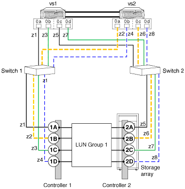

= Interrupção válida: Configuração de grupo LUN de matriz de oito portas
:allow-uri-read: 
:icons: font
:imagesdir: ../media/

[role="lead"]
Você pode usar uma configuração de grupo LUN de oito portas para conetar storage arrays com sistemas ONTAP em grandes implantações em cluster que exigem maior redundância de caminho e balanceamento de carga do que possível com menos portas por grupo LUN.

Você pode configurar essa configuração com as conexões back-end cruzadas ou não cruzadas.

== Variação na qual as conexões back-end são cruzadas

Em uma configuração com as conexões de back-end cruzadas, as conexões FC da mesma controladora de storage array vão para ambos os switches de malha (redundantes).

Esse esquema de conexão faz melhor uso de portas de switch e de storage do que se as conexões de back-end não forem cruzadas, o que reduz o impactos de uma falha de controladora de storage ou switch.

Para storage arrays com apenas dois controladores, uma configuração de grupo LUN de oito portas cruzada é preferível em uma configuração de grupo LUN de matriz de oito portas que não seja cruzada.

Você só pode cruzar o grupo LUN de array de oito portas quando houver caminhos dedicados de cada nó (um zoneamento de porta iniciador de FC para um destino por caminho).

image::../media/eight_port_array_lun_group_configuration_crossed.gif[configuração de grupo lun de matriz de oito portas cruzada]

Nesta ilustração de conexões back-end cruzadas, observe como os sistemas ONTAP são conetados aos switches e ao storage array. O VS1 usa o switch 1 ao conetar-se ao storage storage storage controlador 1 porta 1A e controlador 2 porta 2C, e usa o switch 2 ao conetar ao storage storage storage controlador 2 portas 2A e controlador 1 porta 1C.

A tabela a seguir resume o zoneamento para um grupo LUN de matriz de oito portas com conexões back-end cruzadas. O zoneamento de um único iniciador é a estratégia de zoneamento recomendada.

|===
| Zona | Porta do iniciador de FC no sistema ONTAP | Storage array 

 a| 
Interrutor 1

 a| 
z1
 a| 
VS1, porta 0a
 a| 
Controlador 1, porta 1A

 a| 
z2
 a| 
VS2, porta 0a
 a| 
Controlador 1, porta 1B

 a| 
z3
 a| 
VS1, porta 0b
 a| 
Controlador 2, porta 2C

 a| 
z4
 a| 
VS2, porta 0b
 a| 
Controlador 2, porta 2D

 a| 
Interrutor 2

 a| 
z5
 a| 
VS1, porta 0C
 a| 
Controlador 2, porta 2A

 a| 
z6
 a| 
VS2, porta 0C
 a| 
Controlador 2, porta 2B

 a| 
z7
 a| 
VS1, porta 0d
 a| 
Controlador 1, porta 1C

 a| 
z8
 a| 
VS2, porta 0d
 a| 
Controlador 1, porta 1D

|===

== Variação na qual as conexões back-end são _not_ cruzadas

Em uma configuração em que as conexões de back-end não são cruzadas, as conexões FC do mesmo controlador de storage array passam para apenas um switch de malha.

A ilustração a seguir mostra o pathing em uma configuração com um grupo LUN de matriz de oito portas no qual as conexões back-end não são cruzadas:

A tabela a seguir resume o zoneamento para um grupo LUN de matriz de oito portas quando as conexões back-end não são cruzadas. O zoneamento de um único iniciador é a estratégia de zoneamento recomendada.

|===
| Zona | Porta do iniciador de FC no sistema ONTAP | Storage array 

 a| 
Interrutor 1

 a| 
z1
 a| 
VS1, porta 0a
 a| 
Controlador 1, porta 1A

 a| 
z2
 a| 
VS2, porta 0a
 a| 
Controlador 1, porta 1B

 a| 
z3
 a| 
VS1, porta 0b
 a| 
Controlador 1, porta 1C

 a| 
z4
 a| 
VS2, porta 0b
 a| 
Controlador 1, porta 1D

 a| 
Interrutor 2

 a| 
z5
 a| 
VS1, porta 0C
 a| 
Controlador 2, porta 2A

 a| 
z6
 a| 
VS2, porta 0C
 a| 
Controlador 2, porta 2B

 a| 
z7
 a| 
VS1, porta 0d
 a| 
Controlador 2, porta 2C

 a| 
z8
 a| 
VS2, porta 0d
 a| 
Controlador 2, porta 2D

|===

== Considerações para o número máximo de LUNs de array por iniciador de FC

Ao configurar uma configuração com um grupo LUN de array de oito portas, não é possível exceder o número de LUNs de array compatíveis com o ONTAP por porta iniciador FC.
