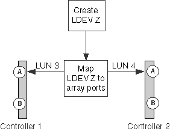

= As IDs de LUN para o mesmo LDEV não correspondem
:allow-uri-read: 
:icons: font
:imagesdir: ../media/

[role="lead"]
Um dispositivo lógico (LDEV) deve ser mapeado para o mesmo ID LUN em todas as portas de storage array sobre as quais ele deve ser visível para os sistemas ONTAP. A `storage errors show` saída identifica os LDEVs cujos IDs de LUN não correspondem.

O ONTAP não permite que você atribua LUNs de storage a um sistema ONTAP se as IDs de LUN não corresponderem.

== Erros de armazenamento mostram mensagem

[listing]
----

HIT-1.4 (4849544143484920443630303035323430303132): This Array LUN is using multiple LUN IDs.  Only one LUN ID per serial number is supported.
----

== Explicação

Um dos seguintes erros foi feito durante a configuração do storage array:

* O LDEV é apresentado à mesma porta do iniciador FC do sistema ONTAP a partir de várias portas de destino e as IDs de LUN não são consistentes.
* As IDs de LUN de dois LDEVs são trocadas.
+
Neste caso, um erro é relatado para cada LUN de matriz.

* Diferentes IDs de LUN para o mesmo LDEV são usados ao mapear o LDEV para portas de storage array que estão apresentando o LDEV para o sistema ONTAP.

[NOTE]
====
Esse erro é mais provável de ocorrer em matrizes de armazenamento em que cada porta é configurada separadamente, por exemplo, em matrizes de armazenamento Hitachi. Em alguns storages, por exemplo, matrizes de armazenamento IBM, as portas não são configuradas separadamente.

====
* A configuração de endereçamento do conjunto de volume é inconsistente nas portas nas quais o LUN é mapeado.
+
Em um array de armazenamento EMC Symmetrix, o problema seria que a configuração de endereçamento do conjunto de volume varia nas portas do diretor de canal.

== Cenário de problema

Este cenário discute o caso de IDs de LUN inconsistentes conforme se aplica à maioria dos storages de armazenamento. Consulte a seção endereçamento de conjunto de volume é inconsistente para uma discussão sobre essa mesma mensagem de erro no contexto de endereçamento de conjunto de volume mal configurado.

xref:reference_volume_set_addressing_is_inconsistent.adoc[O endereçamento do conjunto de volume é inconsistente]

Suponha que o administrador da matriz de armazenamento crie um novo LDEV Z. o ID LUN para LDEV Z deve ser LUN 3. No entanto, o administrador apresenta o LDEV Z como LUN 3 na porta 1A do controlador do storage de armazenamento e como LUN 4 na porta 2A do controlador do storage de armazenamento, como mostra a ilustração a seguir:

Para corrigir esse problema, o mesmo ID LUN deve ser atribuído a um LDEV em todas as portas às quais o LDEV é mapeado. Neste exemplo, o LDEV deve ser apresentado como LUN ID 3 em ambas as portas.

== Resolução de problemas e resolução de problemas

Para corrigir o problema, o administrador do storage de armazenamento deve remapear o LUN, usando o ID de LUN correto. Você pode usar os comandos ONTAP para obter os detalhes necessários para fornecer informações sobre o problema ao administrador de armazenamento.

. Reveja a `storage errors show` saída para identificar o LUN de matriz cujas IDs de LUN não correspondem.
+
Quando as IDs de LUN para o mesmo LDEV não coincidem, a saída identifica o número de série do LDEV com o problema. Por exemplo:

+
[listing]
----

mysystem1a::> storage errors show
Disk: HIT-1.4
UID: 48495441:43484920:44363030:30353234:30303132:00000000:...
----------

HITACHI_DF600F_1
----------
HIT-1.4 (4849544143484920443630303035323430303132): This Array LUN is using multiple LUN IDs.  Only one LUN ID per serial number is supported.
----
+
[NOTE]
====
O UID neste exemplo é 48495441:43484920:44363030:30353234:30303132:00000000:00000000:00000000:00000000:00000000. Ele é truncado no exemplo por causa do espaço.

====
. Obtenha detalhes sobre quais IDs de LUN estão sendo usados para o mesmo LDEV digitando o seguinte comando: `storage disk show arrayLUNname`
+
A `storage disk show` saída para este exemplo mostra o seguinte:

+
[listing]
----

mysystem1a::> storage disk show -disk HIT-1.4
                  Disk: HIT-1.4
        Container Type: unassigned
            Owner/Home: -  / -
               DR Home: -
                 Array: HITACHI_DF600F_1
                Vendor: HITACHI
                 Model: DF600F
         Serial Number: D600020C000C
                   UID: 48495441:43484920:44363030:30353234:30303132:00000000:...
                   BPS: 512
         Physical Size: -
              Position: present
Checksum Compatibility: block
             Aggregate: -
                  Plex: -
Paths:
                     LUN  Initiator Side  Target Side
Controller Initiator ID   Switch Port     Switch Port      Acc Use  Target Port     TPGN...
---------- --------- -------------------- ----------------- --- ---  --------------- ----
mysystem1a   0c       4  vgci9148s76:1-2  vgci9148s76:1-9  AO  INU  50060e80004291c1  1
mysystem1a   0a       3  vgbr300s89:1     vgbr300s89:9     S   RDY  50060e80004291c0  2
mysystem1b   0c       4  vgci9148s76:1-4  vgci9148s76:1-9  AO  INU  50060e80004291c1  1
mysystem1b   0a       3  vgbr300s89:3     vgbr300s89:10    S   RDY  50060e80004291c2  2

Errors:
HIT-1.4 (4849544143484920443630303035323430303132): This Array LUN is using multiple LUN IDs.  Only one LUN ID per serial number is supported.
----

[NOTE]
====
O UID neste exemplo é 48495441:43484920:44363030:30353234:30303132:00000000:00000000:00000000:00000000:00000000. Ele é truncado no exemplo por causa do espaço.

====
Olhando para as IDs de LUN na seção caminhos do disco de armazenamento show output, você pode ver que as IDs de LUN 3 e 4 estão sendo usadas para este LDEV.

. Determine qual ID LUN não está correta para o LDEV.
+
A ID LUN 4 é a ID LUN incorreta neste exemplo.

. No ONTAP, use o `storage path quiesce` comando para quiesce o caminho incorreto para o LUN de array.
+
O exemplo a seguir mostra as opções para adicionar ao `storage path quiesce` comando para o caminho que está sendo silenciado--ID LUN 4 no iniciador 0C.

+
[listing]
----

storage path quiesce -node mysystem1a -initiator 0c -target-wwpn 50060e80004291c1 -lun-number 4
----
+
O `storage path quiesce` comando suspende temporariamente a e/S para um LUN de array específico em um caminho específico. Algumas matrizes de armazenamento requerem a interrupção de e/S por um período de tempo em que um LUN de array deve ser removido ou movido.

+
Depois que o caminho é interrompido, o ONTAP não pode mais ver esse LUN.

. Aguarde um minuto para que o temporizador de atividade do storage expire.
+
Embora nem todos os storages de armazenamento exijam a interrupção da I/o por um período de tempo, é uma boa prática fazê-lo.

. Na matriz de armazenamento, remapear o LUN para a porta de destino usando a ID de LUN correta, ID de LUN 3 neste cenário.
+
Na próxima vez que o processo de descoberta do ONTAP for executado, ele descobrirá o novo LUN de array. O Discovery é executado a cada minuto.

. Após a conclusão da descoberta do ONTAP, execute `storage array config show` novamente no ONTAP para confirmar que não há mais um erro.

